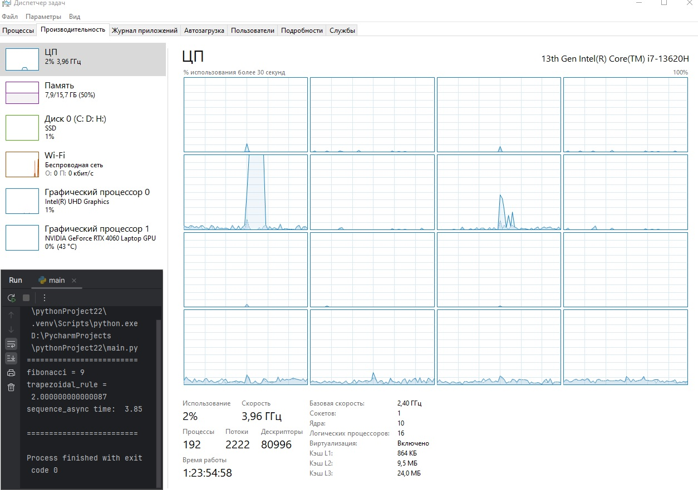

# Работа №13
Крюков Никита Андреевич РИ-230915

## Задание 1

*Примечание:* немного визуально модифицировал код, чтобы была лучше читаемость (визуальная модификация не повлияла на функционал).

**ИСПОЛЬЗОВАЛ 100 ЗАПРОСОВ, ЧТОБЫ БЫЛО ЛУШЧЕ ВИДНО ГРАФИКИ.**

Код задания [тут](https://github.com/ytkinroman/tekhnologii_programmirovaniya_2/blob/main/mp_task_01.py).

*(или тут https://github.com/ytkinroman/tekhnologii_programmirovaniya_2/blob/main/mp_task_01.py)*

### Обычное состоняие

### Тест последовательного выполнения

### Тест выполнения через потоки

### Тест выполнения через процессы

### Вывод
**Последовательный запуск оказался самый медленный** (17,72 сек.), это связано с тем, что всё выполняется друг за другом, по очереди в одном потоке. Каждая задача начинается только после завершения предыдущей.

**Потоки работают быстрее ВСЕХ** (1,36 сек), это связано с тем, что запросы выполняется параллельно в нескольких потоках. Потоки делят общую память и ресурсы процесса, в котором они созданы. Это даёт быструю передачу данных между потоками.

**Процессы** выполняются параллельно (7,26 сек.), почти как потоки, быстрее более чем в два раза по сравнению с последовательным выполнением. На них уходит больше ресурсов. Процессы в отличие от потоков, имеют свою собственную память и ресурсы, что делает их изолированными друг от друга, из-за чего имеют более длитиельную передачу даных между друг другом.

## Задание 2
Код задания [тут](https://github.com/ytkinroman/tekhnologii_programmirovaniya_2/blob/main/mp_task_02.py).

*(или тут https://github.com/ytkinroman/tekhnologii_programmirovaniya_2/blob/main/mp_task_02.py)*

### Обычное состоняие

### Тест последовательного выполнения

### Тест выполнения через потоки

### Тест выполнения через процессы

### Вывод
**Последовательный подход** (3,81 сек.) в этом случае задачи выполняются одна за другой.

Очень долго пытался понять в чем прикол, почему потоки в данном случае уступают последовательному подходу...
**Потоки** (3,85сек.) позволяют выполнять задачи параллельно, используя один и тот же процесс, но результаты как будто это не демонстрируют, оказывется, что это связано с тем, что Python имеет глобальную блокировку интерпретатора (GIL), которая позволяет выполнять только один поток Python-кода за раз. В результате, потоки не могут полностью использовать преимущества многопоточности на уровне CPU.

**Процессы** (2,51 сек.) позволяют выполнять задачи параллельно, используя несколько процессоров или ядер. В отличие от потоков процессы работают хорошо. Это связано с тем, что каждый процесс имеет свой собственный интерпретатор Python и не ограничен GIL. Таким образом, процессы в рамках задачи могут полностью использовать преимущества многопроцессорных систем.

## Задание 3
Нужно модифицировать код [mp_task_01.py](https://github.com/ytkinroman/tekhnologii_programmirovaniya_2/blob/main/mp_task_01.py) и [mp_task_02.py](https://github.com/ytkinroman/tekhnologii_programmirovaniya_2/blob/main/mp_task_02.py) с помощью асинхронных функций библиотеки asyncio.

### Модификация mp_task_01.py (с использованием asyncio)
Модифицированный код mod_mp_task_01.py [тут](https://github.com/ytkinroman/tekhnologii_programmirovaniya_2/blob/main/mod_mp_task_01.py).

*(или тут https://github.com/ytkinroman/tekhnologii_programmirovaniya_2/blob/main/mod_mp_task_01.py)*

### Тест последовательного выполнения

### Тест выполнения через потоки

### Тест выполнения через процессы

### Модификация mp_task_02.py (с использованием asyncio)
Модифицированный код mod_mp_task_02.py [тут](https://github.com/ytkinroman/tekhnologii_programmirovaniya_2/blob/main/mod_mp_task_02.py).

*(или тут https://github.com/ytkinroman/tekhnologii_programmirovaniya_2/blob/main/mod_mp_task_02.py)*

### Тест последовательного выполнения

### Тест выполнения через потоки

### Тест выполнения через процессы

